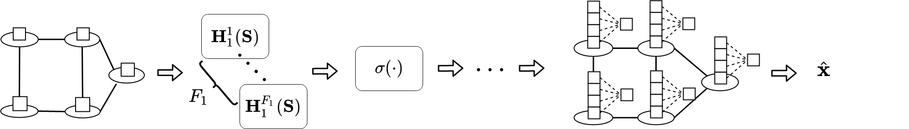
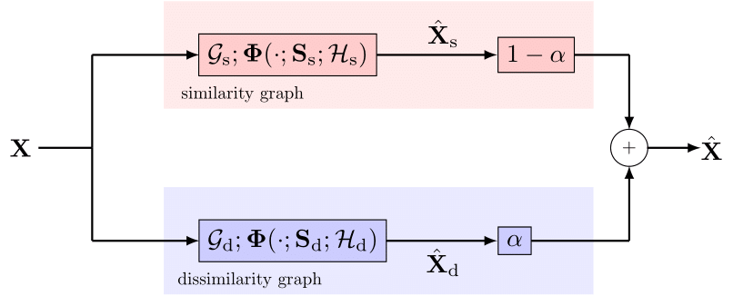

# Accuracy-Diversity Trade-off in Recommender Systems via Graph Convolutions
This repository contains the code of the paper *"Accuracy-Diversity Trade-off in Recommender Systems via Graph Convolutions"*. For any question or suggestion, please e-mail Matteo Pocchiari at <matteo.pocchiari@hotmail.it> or Elvin Isufi at <E.Isufi-1@tudelft.nl>.

Parts of this code are taken verbatim from the source code of the paper *"Rating Prediction via Graph Signal Processing" (Huang et al., 2018)* available [here](https://drive.google.com/file/d/1V-P38rQhsUAaBUeI6CySJkIVgT1ft0oI/view), while the graph neural networks part is inspired to the GNN library implemented by Fernando Gama, available [here](https://github.com/alelab-upenn/graph-neural-networks).

When using part of this code, please cite the following paper

Elvin Isufi, Matteo Pocchiari, Alan Hanjalic, "Accuracy-Diversity Trade-off in Recommender Systems via Graph Convolutions". __COMPLETE CITATION__

1. [Introduction](#intro)
2. [Accounting For *Di*similar Furthest Neighbors](#dis)
3. [Code](#code)

## 1. Introduction
In the RS setting, we work with a user set $\ccalU = [u_1, \ldots, u_U]$ with cardinality $|\ccalU| = U$ and an item set $\ccalI = [i_1, \ldots, i_I]$ with cardinality $|\ccalI| = I$. Users interact with items by giving a rating (often a scalar from one to five). This setting is represented with the user-item matrix (UIM) $\bbX \in \reals ^ {U \times I}$, where the rating user $u$ gave to item $i$ is the entry $X_{ui}$. The objective is to populate matrix $\bbX$ by exploiting the relationships between users and items contained in the available ratings. We capture these relationships through a graph, which is built following the principles of NN collaborative filtering. This graph is used to predict ratings and the $k$ items with the highest predicted rating form the recommendation list.

  

## 2. Accounting For *Di*similar Furthest Neighbors
We propose to use graph convolutions for establishing a novel accuracy-diversity trade-off for RS, by means of a novel accuracy-diversity trade-off framework for RS via graph convolutions. The model jointly operates on a NN graph to improve accuracy and on a FN graph to improve diversity. Each graph can capture user-user or item-item relationships, allowing to also include the hybrid settings, such as a user-NN and an item-FN graph. We develop design strategies that estimate the joint model parameters in view of both accuracy and diversity. These design strategies are versatile to both rating and ranking frameworks. In the rating case, they optimize the mean square error between the prediction and the true rating and consider the accuracy-diversity trade-off as a regularizer. In the ranking case, they optimize the Bayesian personalized ranking criterion proposed by [Rendle et al.](https://arxiv.org/abs/1205.2618), to account for the final order in the recommendation list, and the accuracy-diversity trade-off is also considered the regularizer.

### Leveraging Negative Correlations
We work with a NN similarity-graph  and a FN dissimilarity-graph . The dissimilarity graph is built by following the opposite principles of NNs, i.e., connecting each entity to its top-*n* most negatively related ones. On each graph  and  we have a convolutional module ) and ), outputting an estimate of the user-item matrix  and , respectively. We combine the two outputs in the joint estimate \hat{\boldsymbol{X}}_\text{s}+\alpha\hat{\boldsymbol{X}}_\text{d}), where scalar  balances the influence of the similar and dissimilar connections.

Each graph   or  can be a user or an item graph and the graph convolutional modules ) can be linear or nonlinear. This framework yields eights combinations to investigate the trade-off. To ease exposition, we shall discuss the theoretical methods with the hybrid combination user NN graph (i.e.,  with adjacency matrix  for item *i*) and item FN graph (i.e.,  with adjacency matrix  for user *u*). This setting implies we predict rating  by learning, on one side, from the coupling ), and, on the other side, from the coupling ).

    

### Learning For Rating
We estimate the joint model parameters w.r.t. the mean squared error (MSE) criterion. Analyzing the MSE quantifies also the trade-off for all items in the dataset (unbiasing the results from the user preferences in the list). To this end, consider a training set of user-item pairs *T*={(*u*,*i*)} for the available ratings in **X**. Consider also the user-similarity graph , the item-dissimilarity graph (i.e., , and their respective graph convolutions ) and ). We estimate parameters and  by solving the regularized problem

  

where \in\ensuremath{\mathcal{T}}}\big(\cdot;&space;\cdot\big)) measures the fitting error w.r.t. the available ratings , while the second term acts as an accuracy-diversity regularizer. The two filters ) and ) can be either two plain graph convolutional filters, or two GCNNs, with implications about optimality and expressivity, which we discuss thoroughly in the paper.

### Learning For Ranking
We considered the Bayesian personalized ranking (BPR), which is a state-of-the-art learn-to-ranking framework [(Rendle et al.)](https://arxiv.org/abs/1205.2618). BPR considers the rating difference a user *u* has given to two items *i* and *j*. The term =\hat{\boldsymbol{X}}_{ui}(\ensuremath{\mathcal{H}}_\text{s},\ensuremath{\mathcal{H}}_\text{d})-\hat{\boldsymbol{X}}_{uj}(\ensuremath{\mathcal{H}}_\text{s},\ensuremath{\mathcal{H}}_\text{d})) is used in the loss function

  

where ) is the sigmoid function. More details about the BPR criterion and its derivation can be found in the paper. As in the case of rating optimization, the convolutions ) and ) used in the prediction ) can be either two plain graph convolutional filters or two GCNNs.

## 3. Code
The code is written in Python 3. Model with linear optimization rely on [`NumPy`](https://numpy.org) and [`SciPy`](https://www.scipy.org/), while models with nonlinear optimization make use of [`PyTorch`](https://pytorch.org/). Linear rating optimization is taken from the source code of the paper *"Rating Prediction via Graph Signal Processing" (Huang et al., 2018)* available [here](https://drive.google.com/file/d/1V-P38rQhsUAaBUeI6CySJkIVgT1ft0oI/view). Linear ranking optimization is inspired to the BPR implmentation from the code of the paper *"Bayesian Personalized Ranking with Multi-Channel User Feedback (Loni et al., 2016)"*, available [here](https://github.com/YuyangZhangFTD/awesome-RecSys-papers/blob/master/RecSys16/Bayesian%20Personalized%20Ranking%20with%20Multi-Channel%20User%20Feedback.pdf). Nonlinear rating and ranking optimization is inspired to the GNN implementation of Fernando Gama, available [here](https://github.com/alelab-upenn/graph-neural-networks).

### Dependecies
To run the code, the following libraries are required: `os`, `argparse`, `torch`, `sys`, `numpy`, `scipy`, `ast`, `time`, `datetime`, `math`, `itertools`, `pickle`.

### Usage
The code is divided into four main files: `linearRating`, `linearRanking`, `nonlinearRating`, `nonlinearRanking`, corresponding to the four possible aforementioned combinations. To run the code, download/clone the repository on your desktop, open the terminal in the folder and run from the terminal: `python [selected_mode] [parameters]`.

The list of parameters is the following:
- `-method [string: UU (default), UI, IU, II]`: defines the combination of users/items to use. The first letter defines the similarity source, while the second defines the dissimilarity source (U for users, I for Items).
- `-simOrd [int: default 1]`: defines the order of the graph filter applied on the similarity graph.
- `-disOrd [int: default 1]`: defines the order of the graph filter applied on the dissimilarity graph.
- `-simNeigh [int: default 30]`: defines the number of neighbors in the similarity graph.
- `-disNeigh [int: default 40]`: defines the number of neighbors in the dissilarity graph.
- `-mu [float: default 1.0]`: defines the parameter responsible for the overfitting in the optimization function.
- `-alpha [float: default 0.1]`: defines the value of alpha, i.e. how much importance should be given to the dissimilarity graph.
- `-dataset [string: ml100k (deafult), ml1m, douban, flixster]`: defines the dataset to use.
- `-epochs [int: default 1]`: defines the number of epochs, i.e. how many times the dataset is traversed in the training.
- `-lr [float: default 0.001]`: defines the learning rate.
- `-batch [int: default 1]`: defines the batch size.
- `-neg [int: default 4]`: defines the number of "negative" samples to consider in the BPR, in case of ranking optimization.
- `-feat [list: default [1,2]]`: defines the number of features of the GCNN.

The script `linearRating.py` accepts as parameters `-method`, `-simOrd`, `-disOrd`, `-simNeigh`, `-disNeigh`, `-mu`, `-alpha`, `-dataset`; 

The script `linearRanking.py` accepts as parameters `-method`, `-simOrd`, `-disOrd`, `-mu`, `-alpha`, `-dataset`, `-epochs`, `-batch`, `-neg`, `-lr`;

The script `nonlinearRating.py` accepts as parameters  `-method`, `-simOrd`, `-disOrd`, `-mu`, `-alpha`, `-dataset`, `-epochs`, `-batch`, `-lr`,  `-feat`; 

The script `nonlinearRanking.py` accepts as parameters  `-method`, `-simOrd`, `-disOrd`, `-mu`, `-alpha`, `-dataset`, `-epochs`, `-batch`, `-lr`, `-feat`, `-neg`; 

### Examples
- *Linear rating optimization*: `python linearRating.py -method UI -simOrd 3 -disOrd 2 -simNeigh 30 -disNeigh 40 -mu 0.5 -alpha 0.1 -dataset ml100k`
- *Linear ranking optimization*: `python linearRanking.py -method UI -simOrd 1 -disOrd 2 mu 0.5 -alpha 0.1 -dataset ml100k -epochs 1 -batch 1 -neg 4 -lr 0.00001`
- *Nonlinear rating optimization*:  `python nonlinearRating.py -method UI -simOrd 1 -disOrd 2 mu 0.5 -alpha 0.1 -dataset ml100k -epochs 1 -batch 1 -lr 0.00001 -feat [1,4]`
- *Nonlinear ranking optimization*: `python nonlinearRating.py -method UI -simOrd 1 -disOrd 2 mu 0.5 -alpha 0.1 -dataset ml100k -epochs 1 -batch 1 -lr 0.00001 -feat [1,4] -neg 4`
